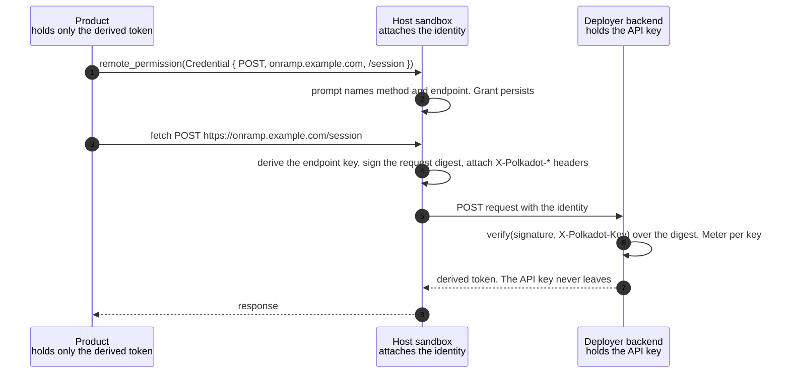

# RFC-0025: Credential-endpoint remote permission

|                 |                                                                                                                   |
| --------------- | ------------------------------------------------------------------------------------------------------------------- |
| **RFC Number**  | 25                                                                                                                |
| **Start Date**  | 2026-08-03                                                                                                        |
| **Authors**     | Tiago Tavares                                                                                                     |
| **Description** | Add a `RemotePermission::Credential` variant granting one method and path, with a caller identity the host attaches |

## Summary

Add one variant to `RemotePermission` ([RFC-0002](0002-permission-model.md)), `Credential`, granting outbound access to a single `(domain, path, method)` rather than a whole domain. For every request the grant covers, the host attaches an sr25519 identity it derives from the user's root entropy, scoped to that wallet, that product, and that endpoint.

The goal is to let a product use a service that requires a secret. The secret stays on a backend the deployer runs, unreadable by host and product. The product receives a derived token. The identity binds each request to one wallet, one product, and one endpoint, so the backend can gate what it issues without accounts.

Products keep issuing their own requests. The host sandbox already mediates every one, which is how `Remote` is enforced. A backend behind a `Credential` grant MUST verify the signature. The identity is not optional.

## Motivation

A funding product wants a meld.io API key for fiat onramp. A game wants TURN credentials. Neither can hold one, because a product runs on the user device and anything it holds is readable there. [Meld](https://docs.meld.io/docs/meld-api/getting-started) says so directly: "Always call Meld from your backend. Direct calls from a browser or mobile app expose your API key." So the deployer runs a backend holding the credential, and the product calls it for a derived token. `Remote` already permits that call, but it is domain-wide, so a user approving "access to onramp.example.com" cannot tell one payment session from every endpoint the deployer runs. And it carries no caller identity at all, so the backend has nothing to meter.

Requirements:

1. **The credential never reaches the product.** Only a derived token does.
2. **The user can tell what they approved.** One operation, not a set.
3. **A backend can meter one caller.** The identity is stable across sessions and not product-variable.
4. **A backend can refuse other products.** A signature from another product or endpoint fails verification.
5. **Nothing depends on the host platform.** Desktop and web have no App Attest or Play Integrity equivalent.
6. **A backend needs no chain.** Verification is one signature check against a key the request carries.
7. **Decisions already made survive.** Permissions persist indefinitely ([RFC-0002](0002-permission-model.md)).

## Detailed Design



### The variant

Added to `RemotePermission`:

```rust
/// Outbound access to one method and path on one domain, carrying a
/// caller identity the host attaches (RFC 0025).
Credential {
    /// Domain the grant covers. Covered requests must be `https`.
    domain: String,
    /// Exact path the grant covers. No wildcards.
    path: String,
    /// HTTP method the grant covers.
    method: String,
},
```

Appended last: `RemotePermission` is SCALE-encoded into `CoreStorageKey::PermissionAuthorization`, so amending `Remote` would re-key every stored decision, which [RFC-0002](0002-permission-model.md) requires to persist indefinitely. `Credential` narrows `Remote` rather than replacing it. One triple per grant, and a second triple is a second prompt. Hosts canonicalise `domain` to lower case and `method` to upper case before keying a stored decision. `path` is keyed verbatim.

A grant occupies a single storage slot of its own. The domain-bundle machinery `Remote` uses — wildcard precedence, per-domain fan-out on grant, set-shaped denial — does not apply, because a credential grant names one endpoint rather than a set. A `Remote` grant over `onramp.example.com` is not a `Credential` grant on any of its endpoints, and never becomes one.

### Authorization

1. **No session.** Denied under [RFC-0009](0009-unauthenticated-product-access.md), without a prompt: there is no wallet to derive an identity from. The host does not auto-prompt login.
2. **Covered requests would not be `https`.** Denied, without a prompt. The signature would otherwise travel in plaintext, where a proxy could lift it onto another request.
3. **The triple names a wildcard.** Denied, without a prompt.
4. **Otherwise.** A prompt naming the method, domain, and path.

A product a host treats as trusted holds `Credential` the way it holds every other `RemotePermission`, without a prompt.

### Identity attachment

Each covered request is signed separately. The host attaches:

```text
X-Polkadot-Key        sr25519 public key identifying the caller.
X-Polkadot-Signature  Signature over the digest below.
X-Polkadot-Timestamp  Unix seconds.
X-Polkadot-Nonce      Random per request.
```

The signed digest is

```text
blake2b256(
  "truapi/credential-request/v1"
  ++ len(method) ++ method
  ++ len(domain) ++ domain
  ++ len(path)   ++ path
  ++ len(query)  ++ query
  ++ timestamp_be64
  ++ len(nonce)  ++ nonce
  ++ blake2b256(body)
)
```

with each length a big-endian `u32` byte count. The prefixes prevent boundary ambiguity: without them a request to `onramp.example.com` for `/session` and one to `onramp.example.com/session` for `` would share a preimage. The label separates this digest from every other signature the key tree produces. Query and body are covered so a signature cannot authorise different content. The public key is sent because a verifier needs no registry to check it.

The host derives the key itself, from the session's pre-hashed root entropy source:

```text
product_layer = blake2b256_keyed(product_id, "credential-endpoint-derivation")
per_product   = blake2b256_keyed(root_entropy_source, product_layer)
seed          = blake2b256_keyed(per_product, blake2b256(len-prefixed method, domain, path))
```

with `seed` expanded to an sr25519 keypair. The separator keys the **product-id layer**, not the caller-supplied layer that `host_derive_entropy` ([RFC-0007](0007-derive-entropy.md)) exposes. That placement is what makes the tree unreachable from the product: a product can choose the third argument freely and still never reach a credential key, whereas a separator applied at that layer would let it derive its own and sign covered requests with no grant at all.

The timestamp and nonce are minted by the core rather than by each host, so every host binds a signature the same way.

The host MUST strip caller-supplied `X-Polkadot-*` headers before attaching its own.

The grant is the consent. It authorises these signatures without per-call confirmation: a dialog per HTTP request would be unusable. A request to an endpoint with no grant is refused rather than prompted, because an HTTP request cannot raise a dialog; the product asks through `remote_permission` instead.

### Consuming-backend contract

A backend behind a `Credential` grant MUST:

> Verify the sr25519 signature in `X-Polkadot-Signature` against the key in `X-Polkadot-Key`, over the digest it computes itself from the request as received. Derive the per-caller key it meters from `X-Polkadot-Key`, never from any other field of the request.

The digest is a verification input, so the binding to method, domain, path, query and body is enforced rather than checked. A timestamp window, and a nonce set within it, bound how long a captured signature stays useful.

## Implementation notes

Verification needs an sr25519 implementation and nothing else — no chain connection, no ring, no registry. `@polkadot/util-crypto`'s `signatureVerify`, or any schnorrkel binding, is sufficient; the signing context is the Substrate default, `"substrate"`. Exchange one signed request for a session token if per-request verification is too costly. Conformance-test that one wallet yields one key per endpoint across sessions and unrelated keys across endpoints, methods, paths and products.

## Drawbacks

- **The identity is per wallet, not per person.** One person holding several wallets counts as several callers, so this meters use rather than resisting Sybil attack. A backend that needs one-per-person has to gate on something else.
- **More prompts for chatty products.** `Remote` remains for one broad grant.
- **No bound on use after the grant.** [RFC-0002](0002-permission-model.md) defines no revocation. A grant persists until cleared in host settings.
- **The identity is per product.** The scoping that pins one product means a shared backend sees a different key per product.
- **Product-binding is host-attested.** A modified host can sign under any product id. Wallet-binding is cryptographic: the key is derived from root entropy the host cannot invent, so a caller cannot impersonate another wallet.
- **Only the host's egress path is covered.** A request the host does not intercept carries no identity, and on some hosts that is a large set (see the interception note below).

## Alternatives

- **A ring VRF personhood proof instead of a derived key.** The strongest alternative, and the shape this RFC originally took: the host attaches a proof of people-set membership ([RFC-0004](0004-ringlocation-redesign.md)), and the backend recovers a per-context alias that is one-per-person. It buys Sybil resistance, which the derived key does not. Set aside on cost: it needs a People chain read for ring members on every grant and every request, a ring revision to cache and invalidate, `verifiablejs` in every consuming backend, and it refuses non-members outright. It is also structurally worse on the hosts that most need this — the signing host is native-only, so on Desktop and web every covered request would need an SSO round trip to a paired phone, where entropy derivation happens locally on both sides. Worth revisiting for an endpoint that genuinely needs one-per-person rather than one-per-wallet.
- **Amending `Remote` rather than adding a variant.** One way to ask instead of two, but `RemotePermission` is SCALE-encoded into the persisted permission key, so it would invalidate every stored grant.
- **A `secrets.request` method proxying the call through the host.** An earlier draft. It moves outbound HTTP into the protocol, which [RFC-0002](0002-permission-model.md) assigned to the sandbox, then needs SSRF rules, size bounds, redirect handling, and header stripping to contain what that creates. On the web host, itself a browser page, CORS still applies, so the same call behaves differently per platform.
- **Leave the product to attach its own identity.** It can derive a key through `host_derive_entropy` today and sign with it. What it cannot do is tell the user, at grant time, which endpoint receives that identity — and a key the product holds is a key the product can hand to anyone.
- **Declaring the endpoint in a dotNS text record.** The deployer publishes the backend address and the host resolves it, so rotating it needs no product redeploy and a shared service is declared once rather than copied into every caller. This was the centre of an earlier draft. Set aside because a frontend carrying its own API address is ordinary, and a lookup on the path of every grant adds a failure mode for an ergonomic gain.
- **A trusted execution environment operated by network nodes.** The credential is encrypted to an attested enclave rather than held by a deployer, removing the need for deployer infrastructure entirely. Parachains built for confidential compute, such as Integritee and Phala, exist for this. Out of scope because it replaces the backend rather than the grant, and attestation moves trust to a hardware vendor rather than removing it. Worth revisiting if requiring every deployer to run a service blocks adoption.
- **A Device Uniqueness Backend as a trusted relayer.** Covered requests go to a uniqueness backend, which attests the calling device and forwards them to the deployer, who trusts the relayer instead of verifying signatures. Set aside because it inserts a third party that sees every request, and it makes one central service a dependency of every credentialed call.
- **Path prefixes in the grant.** Fewer prompts, but a prompt naming a prefix asks the user to reason about a set, which is what domain grants already do badly.

## Unresolved Questions

1. **Host coverage is uneven, and two hosts cannot implement this as specified.** Desktop intercepts through `protocol.handle` and sees and rewrites the whole request. iOS intercepts in the container's `fetch`/XHR shim, so it covers those two and no subresource. Android's `shouldInterceptRequest` hands over a read-only `WebResourceRequest` that never exposes the body, so it can neither sign a POST correctly nor attach a header; it needs a JS shim, a loopback proxy, or GET-only coverage. dotli has no outbound interception at all and auto-grants `Remote` today. Each needs its own design.
2. **Should a grant expire?** [RFC-0002](0002-permission-model.md) has no revocation, so a credential grant is permanent once given, and it authorises signing indefinitely.

## Prior Art and References

- **[RFC-0002](0002-permission-model.md)**, permission model: the enum extended here.
- **[RFC-0007](0007-derive-entropy.md)**, `host_derive_entropy`: the product-facing entropy tree this derivation is deliberately separated from.
- **[RFC-0004](0004-ringlocation-redesign.md)**, `create_account_proof`: the ring proof considered under Alternatives.
- **[RFC-0009](0009-unauthenticated-product-access.md)**, the no-session gate.
- [Meld API getting started](https://docs.meld.io/docs/meld-api/getting-started), for the backend-only constraint.
